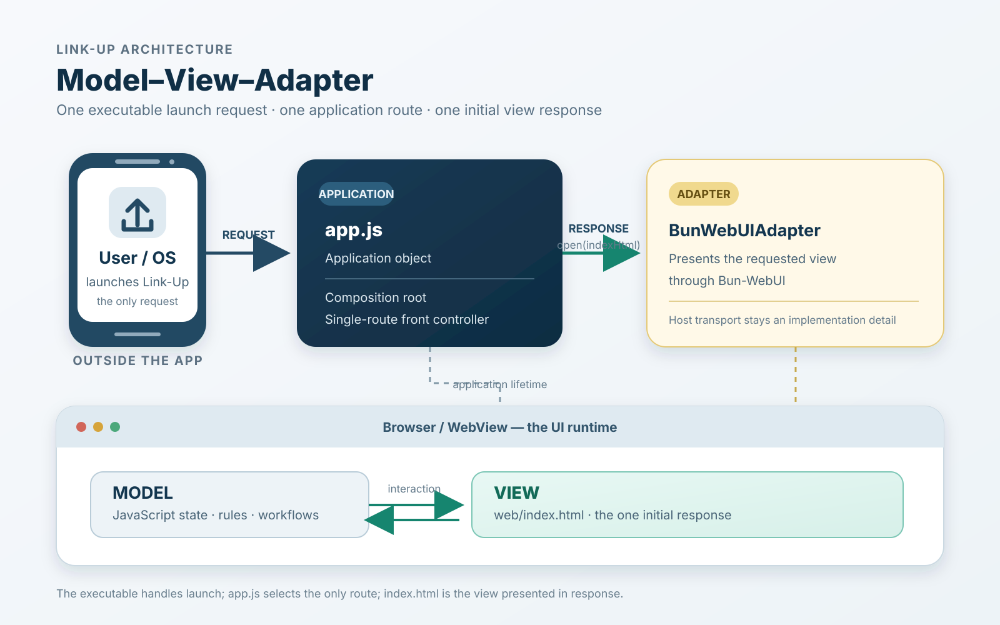
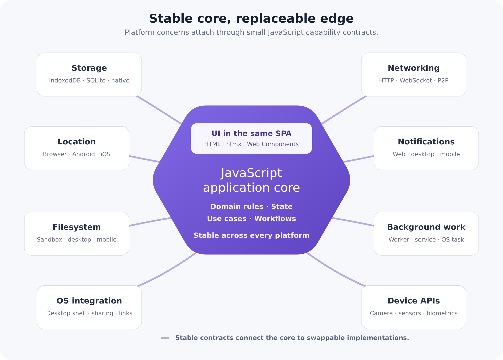

# Link-Up Project Design Doc July 2026

## Architecture

The smallest and most simple decision in architecture is typically the right one.

For the Link-Up project, JavaScript is "good enough". I believe most technical decisions should be made to "good enough".  In all domains, "good enough" should include code that is correct.  In certain domains, "good enough" might mean "feature complete" (think NASA), or "safety features complete" (think a bank).  For this app, the simple decision is JavaScript, which is "good enough".


### Frontend / Backend
---

This app is local-first software and a P2P networked application.  The intended goal, for financial reasons and authority reasons, is for the app to run without centralized servers.  The frontend is htmx; Link-Up does not use hyperscript. Small in-page behaviors that don't warrant a full hypermedia round-trip are implemented as plain JavaScript event listeners. This app strives to be a hypermedia-driven application (HDA).

1. #### Genesis:

    > *"thesis: MPA - multi-page application*
    > 
    > *antithesis: SPA - single-page application*
    > 
    > *synthesis: HDA - hypermedia-driven application*
    > 
    > *— @htmx_org"*


#### Local-First

I like to think there are two definitions of "local-first".  First, the *soft* definition:  Local-first software keeps data on the local client machine and uses servers as redundant backups or replication to other clients.  Then, there's the *hard* definition:  Local-first software keeps all user's data with the user.  The user defines where and when that data can be shared.  This app is using the second definition.

#### Server/Client & P2P

Link-Up is local-first: no server holds the authoritative copy of a user's
data, and the application's essential logic runs on the user's own device.
"Serverless" in this document means that specific claim, not that no server
exists in any capacity — Link-Up's peer network may still depend on remote
systems for discovery, relaying, or synchronization (see Local Authority,
below). Locally, Link-Up is served by a service worker acting as a local
hypermedia server (see Local Hypermedia Server, below): it answers the
frontend's htmx requests with HTML fragments backed by on-device storage, so
the application behaves the same way whether or not a network is reachable.
On desktop, an optional Bun-WebUI adapter packages the same static
application into an installed native window; it is a packaging convenience,
not the mechanism that serves the application.

### Local Hypermedia Server

htmx needs something that answers `fetch()` requests with HTML fragments; it
does not require that something to be a process listening on a socket.
Link-Up's service worker (`web/sw.js`) is that something: it precaches the
application shell on install, then intercepts same-origin `/api/*` requests,
reads and writes the user's data in IndexedDB, and returns HTML fragments —
including htmx response headers such as `HX-Trigger` — exactly as a remote
server would. Every other request is served from the cache, with in-scope
navigations falling back to the cached shell. This is what makes Link-Up an
installable PWA rather than a purely offline static page: the shell installs
from a static host once, and the service worker then serves the application
locally, indefinitely, whether or not that host is ever reachable again.

### WebView UI (optional desktop packaging)

The browser or WebView is the user-interface runtime. On desktop platforms,
Bun-WebUI is an optional, replaceable adapter that opens that runtime on the
same static PWA bundle the browser installs. It is not the Link-Up
application core, does not own Link-Up domain logic, and is not the mechanism
that answers hypermedia requests — the service worker does that uniformly,
whether the page is running as an installed browser PWA or inside a
Bun-WebUI-hosted window.

```text
Link-Up hypermedia-driven web application
└── WebUI adapter (optional, desktop only)
    └── Bun-WebUI
        └── installed browser or WebView
```

The adapter's only job is to open a window on Link-Up's static application
folder. Any privileged, narrowly-scoped host operations Link-Up adds later
should stay behind this same adapter rather than being exposed generally.

### Link-Up UI Architecture Diagram


> This diagram predates the Local Hypermedia Server section above and still
> depicts Bun-WebUI as the single request path. Redrawing it is tracked as
> follow-up work, not yet done.

### Link-Up Domain Objects Diagram


## Project Structure

```text
features/
└── Cucumber specifications and step definitions

src/
├── WebUI/
├── Network/
├── Data/
└── other Link-Up domains as they are introduced

web/
├── index.html          landing/install page
├── app.html             hypermedia SPA (htmx)
├── app.js                shared client script: SW lifecycle, install prompt, in-page behavior
├── sw.js                 service worker: precache + local hypermedia router
├── styles.css
├── manifest.webmanifest
├── vendor/
│   └── htmx.min.js       vendored, not npm-installed
└── icons/
```

Code under `src/` is organized by domain. Ports are stable JavaScript
contracts, and environment-specific adapters implement those contracts.
Operating systems, devices, storage, networks, services, and native hosts stay
at these replaceable edges.

The JavaScript core must not import native bridges, infrastructure SDKs, or
platform packages directly. An adapter is selected when the application starts
and domain code communicates through its contract.

## Local Authority

Link-Up is local-first and peer-to-peer. Its essential business logic executes
locally, and its authoritative user data remains under the user's control.
Remote systems may provide discovery, relaying, synchronization, or other
network capabilities, but they are not the location of the application. This
is the same claim the Server/Client & P2P section above makes about
"serverless": no server holds authority over the application or its data.

The local UI boundary is distinct from the external peer boundary:

```text
Link-Up web application ↔ local adapter ↔ browser or WebView

Link-Up peer ↔ untrusted network ↔ Link-Up peer
```

## Product Features

### Profiles

Users can create and update a Link-Up profile. A user's own profile is stored
locally using the storage available in the browser or installed app.

Users can share their profiles with other Link-Up users and view profiles that
other users share with them. The information included in a profile has not yet
been decided.

### Messaging

Users can send and receive private messages with other Link-Up users. Message
history is stored locally on the user's device.

The installed app can use native notifications to tell a user when a new
message arrives. How users connect, how messages reach an offline user, and
how messages are encrypted have not yet been decided.
