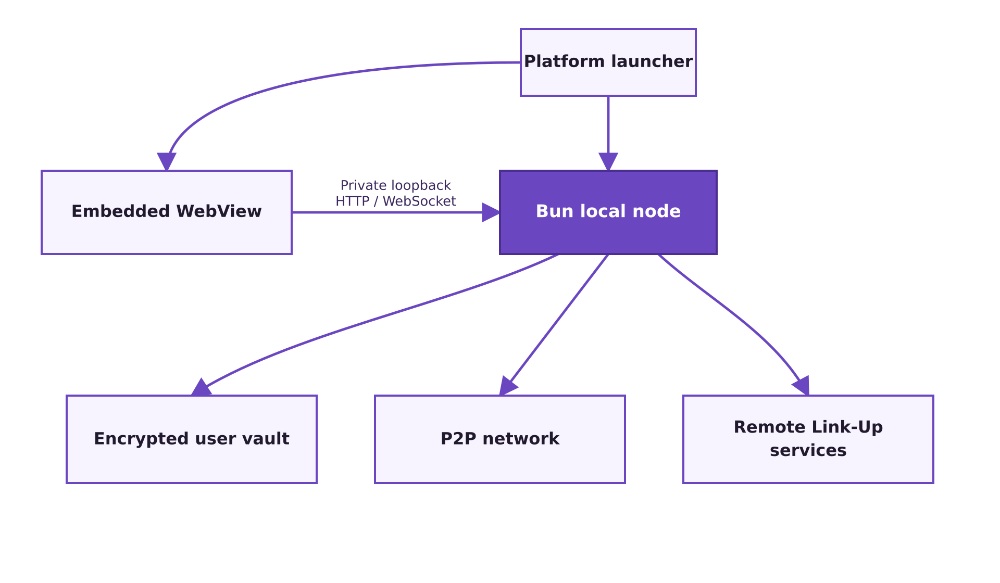

# Link-Up Architecture Chat 4

## Current Architectural Position

Link-Up is intended to be a privacy-centered gay dating and social application whose core experience remains free. Revenue should come from ancillary commerce, sponsorships, advertising, events, and partnerships rather than restricting basic dating functionality.

The central technical goal is to determine whether users can safely contribute meaningful runtime resources so operating cost does not grow like a conventional centralized dating service. This does not remove central services. It narrows their role.

The current direction is:



Link-Up is a locally installed application. A persistent Bun process owns the application runtime, user data, and peer networking. It serves a thin HTML, CSS, and JavaScript interface over a private loopback connection to an embedded WebView.

The WebView is the presentation layer, not the application runtime. The platform launcher remains to be designed.

## Product and Installation Model

The public website is the entry, trust, download, recovery, and update surface:

```text
visit link-up.com
download and install Link-Up
launch the local Link-Up node and WebView
use the app without exposed browser or loopback details
```

### Installation

Installation must install the local node, its UI assets, and a platform launcher. The launcher starts or connects to the Bun process and opens the application in an embedded WebView.

The application must not depend on a service worker, browser cache, or browser-managed installation lifecycle. A PWA manifest may remain useful for the public website or transitional delivery experiments, but it is not part of the installed application architecture.

The installed application should not expose browser chrome, loopback URLs, ports, certificates, or node terminology.

The frontend should remain thin:

```text
HTML
CSS
small JavaScript modules
forms and user interaction
HTTP requests
WebSocket events
```

The local node should own:

```text
application state
encrypted user storage
identity and cryptography
presence
permissions
blocks and reports
peer discovery and networking
synchronization
media storage
communication with Link-Up services
```

The Bun runtime is the application host. The WebView may contain temporary presentation state, but browser-managed storage must not be the authoritative home of user data.

## Authority and Network Roles

Link-Up remains client-heavy and server-light, not serverless.

The local node is a persistent, user-controlled data and network authority. It owns local computation, storage, encryption, peer discovery, connection management, indexing, presence, pub/sub participation, synchronization, and authorized media or message transfer.

The browser engine is intentionally limited to rendering and user interaction. Browser restrictions must not determine Link-Up's storage model, transport selection, connection lifetime, background behavior, or network policy.

Remote Link-Up services remain necessary for functions that require shared authority or reliable public reachability:

- Account bootstrap, recovery, and updates.
- Identity and session authority.
- Rendezvous and signaling.
- Capability issuance and validation.
- Profile visibility and presence authorization.
- Blocks, reports, moderation, and abuse controls.
- Exact-location protection.
- Durable reconciliation and fallback.
- Network and cost measurements.

The remote service should be the referee, rendezvous point, and fallback. It should not become the default engine for work that local nodes can safely perform.

## Presence and Profile Model

The earlier idea that nearby clients would carry and redistribute signed profile envelopes has been superseded.

The current rule is:

> Profiles are live presence objects, not replicated content.

A profile is discoverable only while its owner chooses to be visible, normally while actively using Link-Up. Other clients should not cache or relay strangers' profiles as distributed storage.

Profile transfer must be encrypted and constrained by current visibility, audience, block, and location rules. A user may explicitly request permission to save another profile. If the owner approves, that approval should become a scoped, signed, expiring, revocable, and auditable capability.

Revocation can prevent future access, synchronization, or updates. It cannot erase screenshots, exports, memories, or copies made outside Link-Up.

This model reduces retained sensitive data, scraping exposure, breach impact, and the moderation scope of a distributed profile archive. It does not remove the need for safety controls, metadata minimization, reporting, rate limits, fake-user detection, or legal compliance.

## Location and Locality

Location remains the core organizing primitive.

Link-Up should use H3 geocells as the atomic unit of location. H3 resolution should adapt to local density rather than using uniformly sized cells. Dense areas may use small cells; rural areas may use larger cells. The objective is a useful number of nearby visible users, not uniform physical dimensions.

Discovery should expand locally:

```text
current geocell
adjacent geocells
neighborhood
city
metro
```

Exact coordinates should remain private whenever possible. Product language should favor approximate locality such as “nearby” or “in your area” over unnecessarily precise distances.

Locality should also guide rendezvous, routing hints, static-data caching, backup placement, abuse detection, and recovery.

## Data Model

Authoritative user data must live in a user-owned encrypted vault managed by the local node. This includes identity, keys, profiles, messages, pictures, video, settings, and application history.

SQLite is the current candidate for structured data. Media may be stored as encrypted files referenced by the database. The exact vault layout, backup model, and key-management design remain undecided.

The vault must be recognizable application data rather than opaque browser “site data.” It should eventually support deliberate backup, export, transfer, restoration, and deletion under the user's control.

WebView storage may be used for disposable UI state or caches, but it must never be the only copy of authoritative user data.

The existing three-part classification remains useful:

- Public data is user-approved data that may be disclosed to an authorized audience. Public does not mean globally visible.
- Private data is user-owned or derived data the application may use but should not expose directly to peers.
- Internal data is operational state required to coordinate and protect the system.

Static internal data, such as geodata, boundaries, protocol constants, and localization files, can be content-addressed, signed, and cached near likely demand.

Dynamic internal state, such as rendezvous records, moderation queues, capability logs, and reconciliation state, may use append-only events, checkpoints, and replicated backups while retaining an authoritative home.

The storage principle remains:

> Global addressability, local availability.

That principle now applies primarily to static internal data, authorized user-owned data, media explicitly transferred between participants, and recoverable operational state—not to ambient replication of live profiles.

## Peer Communication

The Bun local node owns peer communication. Its transport model may include TCP, WebSocket, WebRTC, relays, or other libp2p-compatible transports as implementation experiments justify.

The node must retain fine-grained control over peer discovery, connection lifetimes, location-based search and indexing, online-status checks, pub/sub propagation, bandwidth limits, backoff, relay selection, and privacy policy.

Peer communication must not become unrestricted broadcast. Access should be controlled through encrypted, signed, scoped, expiring capabilities and envelopes. Peers may transport authorized data, but transport does not grant authority or permission.

The exact division between direct delivery, relay, mailbox fallback, and durable synchronization has not yet been decided.

## Technology Direction

The current implementation direction is:

```text
Bun.js local application runtime
Bun.serve loopback HTTP and WebSocket interface
compiled local executable
embedded system WebView
encrypted user-owned storage
SQLite
libp2p
plain JavaScript
JSDoc only where useful
tsc/checkJs for static checking
HTML and CSS
small browser JavaScript modules
few dependencies
no React
no TypeScript source
```

Bun is the current implementation of the local node because its runtime provides HTTP, SQLite, filesystem, networking, packaging, and JavaScript ecosystem support. The architecture must keep the UI-to-node protocol explicit so the local node can be replaced without rewriting the UI.

The embedded WebView and platform launcher remain undecided. A framework should not be introduced unless it provides a clear benefit over a small platform-specific launcher.

Go remains a possible future choice for remote, long-lived control-plane services if operational needs justify it. No decision has been made to introduce it.

Htmx remains available as a possible UI tool, but the current repository does not yet establish a final frontend interaction or rendering model.

## Current Repository State

The repository is an early local-node and UI-shell prototype.

Current runtime flow:

```text
build.js
  clean
  typecheck
  compile src/main.js into dist/linkup

dist/linkup
  start Bun.serve
  serve route assets
  return 404 for unknown routes
```

The public build commands are:

```text
bun ./build.js build
bun ./build.js start
```

`build` cleans, typechecks, and compiles the executable. Its test runner is currently disabled. `start` performs the build, starts the compiled executable on the first available port from 3000 through 3009, waits for it to respond, and remains attached to the server process.

The implemented source layout is currently:

```text
build.js
src/
  main.js
  routes.js
public/
  landing page
  application page
  styles.css
  manifest
```

`src/main.js` is the local HTTP entrypoint. `src/routes.js` currently maps:

```text
/     -> public landing page
/app  -> application page
```

The separate routes currently establish a landing surface and an application surface. The browser assets contain a minimal application shell, styling, manifest, and service-worker experiment.

The manifest and service worker reflect the superseded PWA architecture and should be removed or separated from the installed application. The existing Bun server is now the foundation of the intended runtime rather than only a development server.

## Work Completed So Far

The project has established:

- A JavaScript-only Bun project with `checkJs`.
- A standalone compiled executable as the normal runtime artifact.
- A build flow that keeps `build` and `start` as the public commands.
- Synchronous cleanup and typechecking subprocesses where practical.
- Local server startup with port fallback and readiness verification through the compiled executable.
- A local TLS configuration for the Bun server.
- A dedicated local core entrypoint and route module.
- Separate landing-page and app routes.
- A minimal web UI shell using Bulma.
- Basic PWA manifest and service-worker experiments.
- JavaScript-only service-worker checking without TypeScript-specific source annotations.
- Project rules favoring small modules, useful native JavaScript annotations, synchronous APIs where appropriate, and deletion over unnecessary abstraction.

No application data model, identity system, geocell implementation, peer transport, encrypted-vault layer, moderation system, or remote authority service has been implemented in the current source tree.

## Development Goals

The next architectural work should move from the executable shell toward the smallest complete local-node application.

Likely areas of work are:

1. Define the private loopback HTTP/WebSocket contract between the WebView and local node.
2. Define the encrypted user vault, SQLite boundaries, media storage, and key ownership.
3. Establish the libp2p node and experiment with discovery, presence, pub/sub, and location-based indexing.
4. Design the minimum platform launcher and WebView lifecycle without prematurely selecting a framework.
5. Define the minimum account bootstrap and recovery relationship with `link-up.com`.
6. Define presence, visibility, and saved-profile capability semantics.
7. Define the H3-based privacy-preserving location flow.
8. Build a minimal rendezvous and signaling path.
9. Prove one authorized peer-to-peer interaction with a clear fallback path.
10. Add block, report, and revocation behavior before broad discovery.
11. Measure what work peers perform and what remote cost is avoided.

The MVP should prove more than packaging or a dating UI. It should test whether an installed Link-Up node can safely perform meaningful application and network work while remote services retain shared authority and safety controls.

## Decisions Still Open

The existing discussions do not settle:

- The exact platform installation, launch, and update model.
- The exact loopback HTTP/WebSocket protocol.
- The encrypted-vault and media-storage schema.
- The identity and key-ownership model.
- The remote service language and deployment architecture.
- The H3 resolution and density thresholds.
- The signaling protocol and rendezvous topology.
- The scope of TURN use.
- Message durability and offline delivery behavior.
- Media-transfer, storage, and retention rules.
- The exact saved-profile capability lifecycle.
- The frontend rendering approach and the role of htmx.
- Update signing, distribution, and recovery details.
- The MVP's numerical cost and peer-contribution success criteria.

These should remain open until each can be decided from a concrete product requirement, threat model, or implementation experiment.

## Working Architecture Statement

```text
Link-Up is a locally installed application with a web-native UI.

The website brings users into the network.
The Bun local node owns the runtime, encrypted user vault, and peer networking.
An embedded WebView provides the presentation layer.
Remote services provide shared authority, safety, rendezvous, and fallback.
Profiles exist as encrypted, permissioned live presence.
Peers communicate directly only when authorized.
Location organizes discovery without exposing unnecessary precision.
The MVP must measure whether local nodes materially reduce central cost.
```
