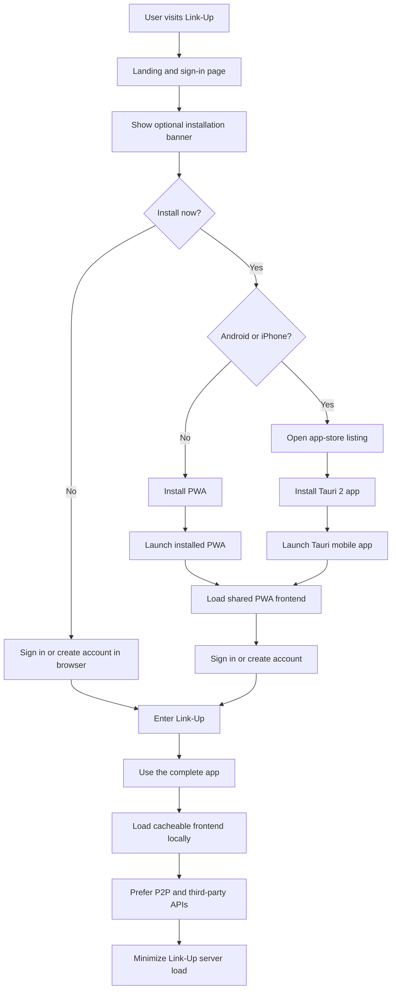

# Link-Up User Flow

Link-Up is a complete Progressive Web App (PWA) that can be used without installation. Installation changes how the app is launched, not what the user can do.

On Android and iPhone, the installation banner directs users to the Tauri 2 mobile app. On other supported platforms, it installs the PWA.

The browser, installed PWA, and Tauri mobile app all converge on the same frontend and complete Link-Up experience.
